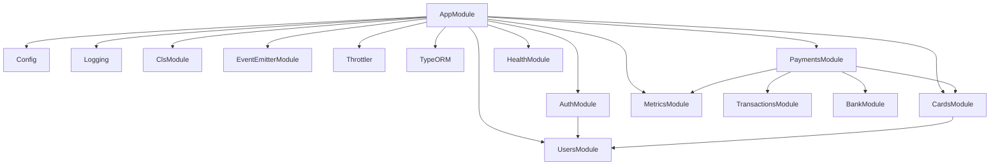
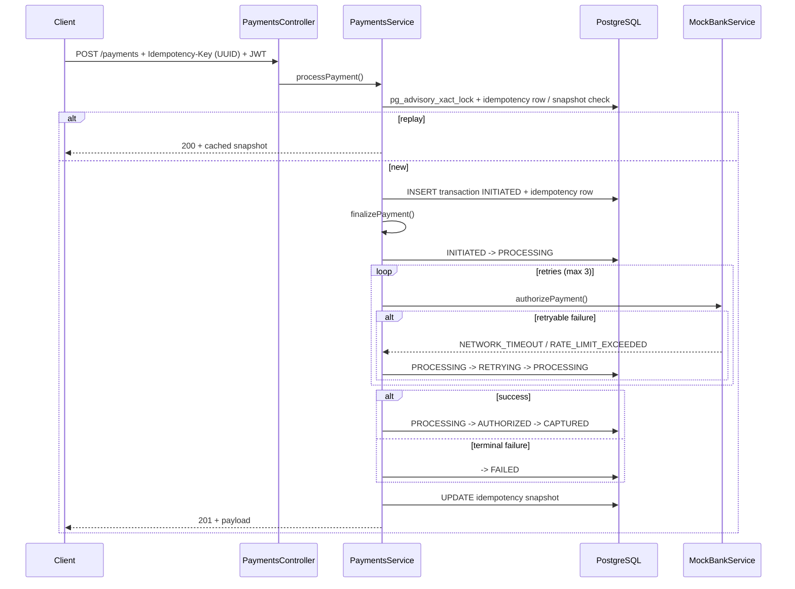
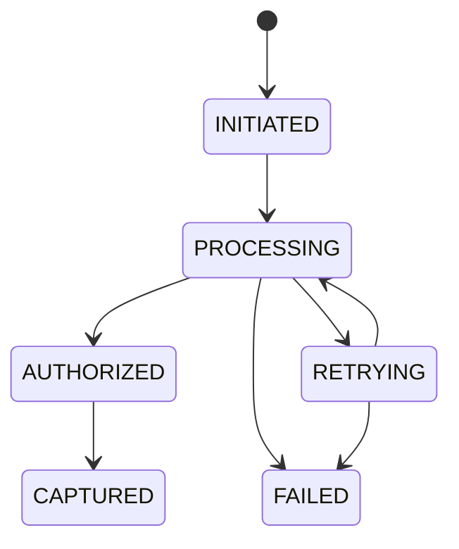
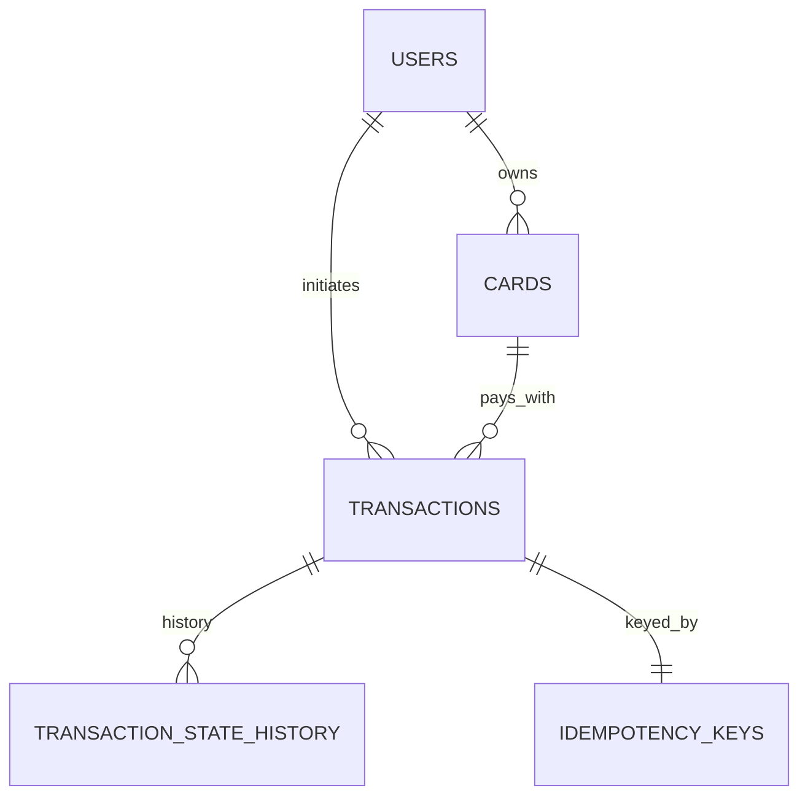
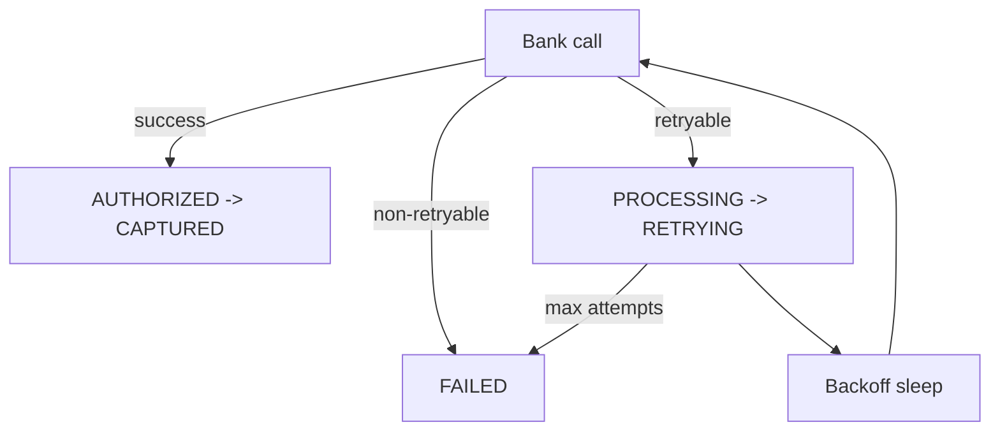

# Architecture

## Module dependency (conceptual)

`AppModule` also registers **global** `JwtAuthGuard`, `AppThrottlerGuard`, `GlobalExceptionFilter`, `CorrelationInterceptor`, `HttpLoggingInterceptor`, and `ResponseTransformInterceptor` (see README for JSON envelopes and idempotency headers).

## Payment flow (sequence)

## Transaction state machine

## Database ER (simplified)

## Retry flow

## Database tables (as implemented)

Aligned with TypeORM migration `InitialSchema` (see `src/database/migrations/`):

| Table | Purpose |
|-------|---------|
| `users` | `id`, unique `email`, `password_hash`, `is_active`, **`role`** enum `user` \| `admin` (default `user`), timestamps |
| `cards` | Per-user tokenized PAN (AES-GCM fields), `last_four`, brand, expiry, `is_active`, FK `user_id` → `users` (CASCADE) |
| `transactions` | Amount/currency, **`idempotency_key` UNIQUE**, `status` enum, auth/failure metadata, `retry_count`, FKs to `users` and `cards` (RESTRICT) |
| `transaction_state_history` | Append-only `from_status` / `to_status` / `reason` / `metadata` per transition |
| `idempotency_keys` | PK = idempotency **key string**; `transaction_id` FK; **`response_snapshot` JSONB**; **`expires_at`** (TTL matches app constant, 24h) |

The ER view `TRANSACTIONS ||--|| IDEMPOTENCY_KEYS` reflects one idempotency row per payment key, tied to exactly one transaction once created (the same UUID is also stored on `transactions.idempotency_key`).

## Authentication

- **passport-jwt**: Bearer token; validated in `JwtStrategy`; payload attached as `req.user` with **`sub`**, **`email`**, **`role`**.
- **Passwords**: bcrypt at registration and login (`UsersService`).

## RBAC (current code)

- **Schema + JWT** carry `user` \| `admin`.
- **`RolesGuard` / `@Roles()`** are implemented but **not registered globally and not used on any controller** — every protected route relies on **JWT + resource ownership** (e.g. card `user_id`, idempotency key scoped to same `sub`).

## HTTP responses & errors

- **Success:** `ResponseTransformInterceptor` wraps handlers in `{ success: true, data, correlationId, timestamp }` and strips sensitive keys (PAN material, hashes). Pagination uses an internal `__pagination` field promoted to `meta`.
- **Idempotent payment replay:** sets response header **`X-Idempotency-Replay: true`** (still `success: true` in body for the replayed snapshot path).
- **Terminal failed payment:** controller returns a terminal shape consumed by the interceptor → **`success: false`** with snapshot under **`data`**, HTTP **`422`** vs **`503`** from `isTransientTerminalFailure(failure_code)` in `payment-http.util.ts`.
- **Exceptions:** `GlobalExceptionFilter` maps `HttpException`, validation messages, unique violations (`23505` → conflict), and optional production message hiding for unknown errors; includes **`correlationId`**.

## Observability & resilience

- **nestjs-cls**: correlation id (from `x-correlation-id` when valid UUID, else generated), used in logs and responses.
- **EventEmitter2**: `TransactionStateMachine.emitTransition` emits **`transaction.state.changed`** (`MetricsService` registers an `@OnEvent` handler as an extension point; retry/duration counters are updated directly from `PaymentsService`).
- **Structured logging**: `HttpLoggingInterceptor`, `AppLoggerService` (Winston).
- **Metrics:** `MetricsService` updated from payment paths; `GET /metrics` guarded by `MetricsApiGuard` when `METRICS_API_KEY` is set.
- **Throttling:** global defaults from `THROTTLE_TTL` / `THROTTLE_LIMIT`; stricter overrides on `POST /auth/register`, `POST /auth/login`, and `POST /payments`; `@SkipThrottle()` on `/health` and `/metrics`.
