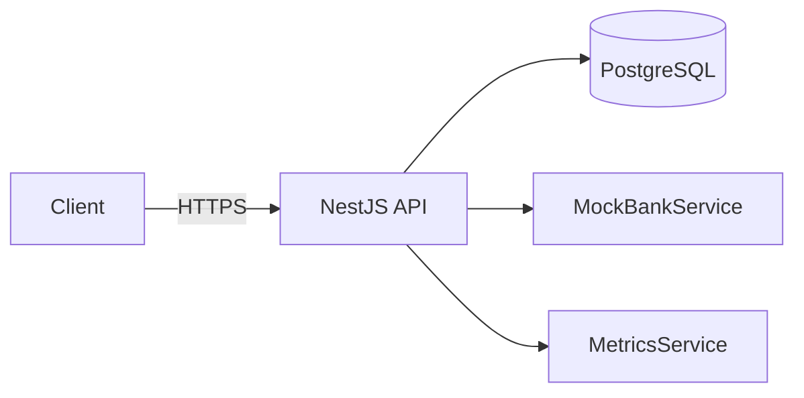

# Payment Provider (NestJS)

Production-oriented reference backend for card tokenization and payments. It demonstrates PCI-minded patterns: no full PAN or CVV in logs or API responses, AES-256-GCM storage for PAN, JWT authentication, idempotent payments, structured logging, rate limiting, and a mock bank with realistic failure modes and retries.

## Architecture (high level)



See [ARCHITECTURE.md](./ARCHITECTURE.md) for module dependencies, payment sequence, state machine, and retry flow.

## Prerequisites

- Node.js 20+ (project scaffold uses Node 22 in Docker)
- PostgreSQL 15+
- npm

## Quick start (local)

1. Copy environment file and adjust secrets:

   ```bash
   cp .env.example .env
   ```

2. Install dependencies:

   ```bash
   npm ci
   ```

3. Create the database (example):

   ```sql
   CREATE DATABASE payment_provider;
   ```

4. Build and run migrations:

   ```bash
   npm run build
   npm run migration:run
   ```

5. Start the API:

   ```bash
   npm run start:dev
   ```

6. Open Swagger (non-production only): `http://localhost:3000/api/docs`

## Docker

```bash
cp .env.example .env
docker compose up --build
```

The `app` service waits for PostgreSQL health before starting. Run migrations inside the app container after first boot:

```bash
docker compose exec app npm run migration:run
```

## Environment variables

| Variable | Description |
|----------|-------------|
| `NODE_ENV` | `development` \| `test` \| `production` |
| `PORT` | HTTP port (default `3000`) |
| `APP_NAME` | Service name for logs |
| `DB_*` | PostgreSQL connection |
| `JWT_SECRET` | HMAC secret (min 32 chars) |
| `JWT_EXPIRY` | Access token TTL (e.g. `15m`) |
| `CARD_ENCRYPTION_KEY` | High-entropy secret (min 32 chars); SHA-256 is applied to derive a 32-byte AES key |
| `THROTTLE_TTL` / `THROTTLE_LIMIT` | Default throttler window |
| `METRICS_API_KEY` | Optional. When set, `GET /metrics` requires matching `X-Metrics-Key` or `Authorization: Bearer` |
| `ALLOWED_ORIGINS` | Comma-separated CORS origins (**required** by config validation; use at least one origin in dev, e.g. `http://localhost:3000`) |

## API summary

| Method | Path | Auth | Notes |
|--------|------|------|------|
| POST | `/auth/register` | Public | Strong password rules; **20 requests / hour / IP** |
| POST | `/auth/login` | Public | **5 requests / minute / IP** |
| POST | `/cards` | JWT | Luhn + AES-GCM tokenization; subject to default global throttle |
| GET | `/cards` | JWT | Paginated (`page`, `limit`); default global throttle |
| GET | `/cards/:id` | JWT | UUID v4 path param |
| DELETE | `/cards/:id` | JWT | Soft delete (`204`); UUID v4 path param |
| POST | `/payments` | JWT | **10 requests / minute / IP** on this route, plus default global throttle. Requires `Idempotency-Key` and/or body `idempotency_key` (must match if both sent). **Value must be a UUID string** (RFC 4122 pattern enforced in code; version nibble `1`–`5`). First captured payment **`201`**; idempotent replay **`200`** and header **`X-Idempotency-Replay: true`**. Terminal failure: non-transient bank decline **`422`**, transient / retry exhaustion **`503`**; body uses `success: false` (see below). |
| GET | `/metrics` | Optional API key | When `METRICS_API_KEY` is set, send `X-Metrics-Key` or `Authorization: Bearer <key>`; otherwise open (dev only) |
| GET | `/health` | Public | DB ping (`SELECT 1`); throttling skipped |

### JSON response shape

- **Success (most routes):** `{ "success": true, "data": <payload>, "correlationId": "<uuid>", "timestamp": "<iso>" }`. Paginated card lists add `"meta": { "page", "limit", "total" }`.
- **Errors:** `{ "success": false, "error": { "code", "message", "details?" }, "correlationId", "timestamp" }` with the matching HTTP status (`429` includes `Retry-After: 60`).
- **Payments — terminal failure:** HTTP `422` or `503` with `{ "success": false, "data": { /* transaction snapshot */ }, "correlationId", "timestamp" }`.

### Authentication

- **JWT** from `POST /auth/login`; send `Authorization: Bearer <token>` on protected routes.
- **Global JWT guard** applies unless the route is `@Public()` (e.g. `POST /auth/register`, `POST /auth/login`, `GET /health`, `GET /metrics`). `GET /metrics` never requires a JWT; when `METRICS_API_KEY` is set, `MetricsApiGuard` requires the metrics key instead.
- **Resource access** is **ownership-based** (JWT `sub` must own the card / idempotency key).

### RBAC

- PostgreSQL **`users.role`** enum: `user` \| `admin` (default `user`). JWT includes **`role`**.
- **`RolesGuard`** / `@Roles()` exist for future admin-only routes; **no endpoint in this repo currently enforces `admin`**.

### Validation

- **class-validator** DTOs and global **`ValidationPipe`** (`whitelist`, `forbidNonWhitelisted`, `transform`).

## Troubleshooting

### `password authentication failed for user "postgres"` (migrations or app)

Your `.env` values must match a real PostgreSQL instance:

- **`DB_PASSWORD`** must be the password for **`DB_USERNAME`** (not necessarily `postgres` / `postgres`).
- Ensure **`DB_NAME`** exists (`CREATE DATABASE payment_provider;`) before running migrations.

**Docker (recommended):** start Docker Desktop, then:

```bash
npm run db:up
```

Wait until Postgres is healthy, keep `.env` aligned with `docker-compose.yml` (`DB_PASSWORD=postgres`, `DB_NAME=payment_provider`), then:

```bash
npm run migration:run
```

### `npm run test:e2e` skips all tests

E2e probes the server using your `.env` credentials against the **`postgres`** database (auth check only). If that fails, suites are **skipped** so CI/local runs still exit 0. Fix credentials or start Postgres, then re-run `npm run test:e2e`.

### Faster migrations after a build

```bash
npm run migration:run:only
```

## Design decisions

- **Bank retries**: Up to four bank authorization attempts (one initial plus three retries) with exponential backoff and jitter, matching a common reading of “maximum 3 retry attempts.”
- **Mock bank transport**: Simulated `ECONNRESET` and HTTP 503-style failures use the same retry path as JSON `NETWORK_TIMEOUT` / `RATE_LIMIT_EXCEEDED` responses.
- **Refresh tokens**: Only access JWTs are issued here. A refresh-token design would store an opaque refresh token (or rotating refresh JWT) hashed at rest (bcrypt/argon2), bind to device/session metadata, expose `POST /auth/refresh` with reuse detection, and revoke on logout or compromise. Redis or a dedicated table with TTL supports rotation and revocation at scale.
- **Idempotency**: PostgreSQL advisory locks per idempotency key plus a dedicated `idempotency_keys` table with JSON snapshot and 24h expiry give atomic first-writer semantics without Redis (Redis would be preferred at high QPS). **Keys must be UUID strings** validated in `PaymentsService` before any DB write.
- **Test database**: When `NODE_ENV=test`, TypeORM `synchronize` is enabled so Jest e2e can run without running migrations first. **Never** set `NODE_ENV=test` in production.

## Known limitations / next steps

- No real PSP or HSM integration; mock bank only.
- No refresh-token endpoint (documented above).
- `GET /metrics` is open when `METRICS_API_KEY` is unset; set the key in any shared environment. `/health` remains public for probes.
- No Redis-backed throttler or idempotency (single-node in-memory throttles only).
- No separate key management service or field-level DB encryption beyond application-layer AES-GCM.

## Scripts

| Script | Purpose |
|--------|---------|
| `npm run start:dev` | Watch mode |
| `npm run build` | Compile to `dist/` |
| `npm run migration:run` | Build + run TypeORM migrations |
| `npm run migration:run:only` | Run migrations only (requires existing `dist/` + `npm run build`) |
| `npm run db:up` | Start Postgres service via Docker Compose |
| `npm test` | Unit tests |
| `npm run test:e2e` | Supertest e2e (skips if DB unreachable; full run needs Postgres + `.env`) |

## Security

See [SECURITY.md](./SECURITY.md) for PCI scope notes, encryption, and data minimization.
